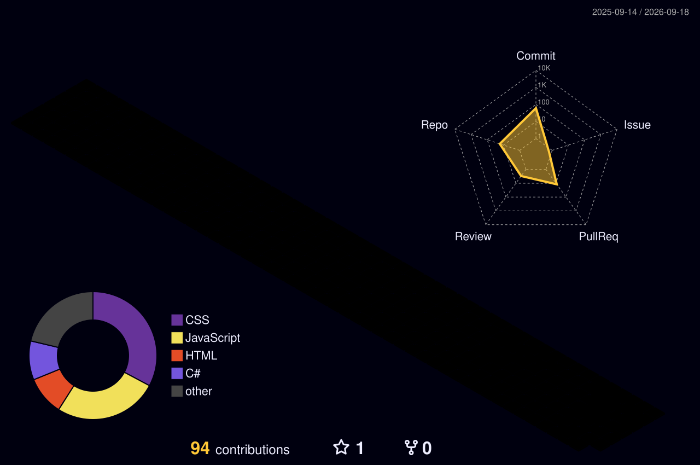

<div align="center">


<br><br>


<br><br>

<a href="https://github.com/ThiagoSilvaPereira01">
  
</a>
<a href="https://github.com/ThiagoSilvaPereira01?tab=repositories">
  
</a>

</div>

---

## Sobre mim

Sou estudante de **Análise e Desenvolvimento de Sistemas**, estudando para me tornar **desenvolvedor Full Stack** e também seguir na área de **DevOps**.

Estou construindo minha base com projetos práticos, estudando lógica de programação, desenvolvimento web, versionamento de código e os primeiros conceitos de cloud e automação.

```ts
const thiagoSilvaPereira = {
  role: "Estudante Full Stack",
  education: "Analise e Desenvolvimento de Sistemas",
  devops: "Em formacao",
  currentStack: ["HTML", "CSS", "JavaScript", "C#", "Git", "GitHub", "Azure"],
  focus: [
    "Desenvolvimento web",
    "Logica de programacao",
    "Versionamento de codigo",
    "Cloud e automacao em estudo"
  ],
  goal: "Criar projetos melhores e construir uma base forte para atuar com DevOps"
};
```

## Minha stack atual

<div align="center">


</div>

## O que estou estudando

<div align="center">

| Desenvolvimento Web | Back-end | DevOps |
| --- | --- | --- |
|  |  |  |
| HTML, CSS e JavaScript | C# | Git, GitHub e Azure |
| Estrutura, estilo e interação | Lógica, fundamentos e organização | Versionamento, cloud e automação em estudo |
| Projetos práticos | Base para aplicações back-end | Caminho para integração e deploy |

</div>

## Digital Workstation

<div align="center">


</div>

## Em evolução

```text
HTML        █████████░░   Estruturacao de paginas
CSS         ████████░░░   Estilizacao e responsividade
JavaScript  ███████░░░░   Interatividade e logica
C#          ██████░░░░░   Fundamentos e aplicacoes
Git         ███████░░░░   Versionamento de projetos
DevOps      █████░░░░░░   Cloud, automacao e entrega
```

## Para recrutadores

<div align="center">

| Buscando evolução | Aprendendo na prática | Construindo portfólio |
| --- | --- | --- |
| Estágio ou oportunidade júnior | Projetos com HTML, CSS, JS e C# | Repositórios organizados |
| Desenvolvimento Full Stack | Git e GitHub no dia a dia | Código simples e documentado |
| DevOps em formação | Azure e cloud em estudo | Evolução constante |

</div>

## GitHub Analytics

<div align="center">


<br><br>

<a href="https://github.com/ThiagoSilvaPereira01?tab=repositories">
  
</a>

</div>

## Contribuições

<div align="center">



<br><br>

<picture>
  <source media="(prefers-color-scheme: dark)" srcset="https://raw.githubusercontent.com/ThiagoSilvaPereira01/ThiagoSilvaPereira01/output/github-contribution-grid-snake-dark.svg" />
  <source media="(prefers-color-scheme: light)" srcset="https://raw.githubusercontent.com/ThiagoSilvaPereira01/ThiagoSilvaPereira01/output/github-contribution-grid-snake.svg" />
  
</picture>

</div>

## Contato

<div align="center">

<a href="https://www.linkedin.com/in/thiago-silva-0537aa192">
  
</a>
<a href="mailto:Thiago.hassil@gmail.com">
  
</a>

</div>

---

<div align="center">


<br><br>


</div>
